# 1️⃣ 기획배경 및 목표
- 금융상품에 가입하고 싶은데 여러 조건들을 비교 분석하기 어렵다는 문제점이 있다.

    ➡️ 여러 예금, 적금 상품을 한눈에 보고 비교할 목적으로 상품을 확인 및 비교하고 커뮤니티, 환율 등의 다양한 서비스를 제공한다.

# 2️⃣ 팀원 정보 및 업무 분담 내역
* 김태경
    * 팀장
    * main BACKEND
    * sub FRONTEND
    * 검토 & 수정 & 보완
* 김규아
    * 팀원
    * main BACKEND
    * main FRONTEND
    * API 관련 업무
    * AI 추천 알고리즘

# 3️⃣ 프로젝트 설계
* 설계 내용
    1. 시스템 개요
        * 목표 : 기존 데이터를 기반으로 한 금융 상품 추천 서비스
    2. 구성 요소

        

        * ArticleDetailView : 게시물 상세 정보(수정 및 삭제, 댓글)
        * CommunityView : 커뮤니티 페이지
        * CreateArticleView : 게시물 생성 페이지
        * DetailView : 상품 상세 정보 페이지
        * exchangeRateView : 환율 계산기 페이지
        * HomeView : 메인 페이지
        * JoinProductsView : 가입한 상품 목록 및 비교 및 AI상품 추천
        * LoginView : 로그인 페이지
        * MapView : 특정 지역의 은행 찾는 페이지
        * ProductsView : 전체 상품 목록 및 상품 목록 filtering 페이지
        * ProfileView : 프로필 페이지(수정 및 탈퇴)
        * SignUpView : 회원 가입 페이지
    3. 기술 스택
        * python 3.9.x
        * Django 4.2.x
        * Node.js 20.x
        * Vue 3 & Pinia
# 4️⃣ 개발 성과
    * 구현된 기능
        * 회원가입, 회원탈퇴, 정보 수정
        * 게시물 생성, 수정, 삭제
        * 댓글 생성, 수정, 삭제
        * 환율 정보 조회
        * 금융 상품 목록 조회 및 상세 정보
        * 게시글 좋아요, 금융상품 관심 등록 서비스
        * 지역단위 주변 은행 검색
        * 가입 상품 비교 차트 및 좋아요 기반 금융상품 추천 AI

# 5️⃣ 데이터 베이스 모델링(ERD)

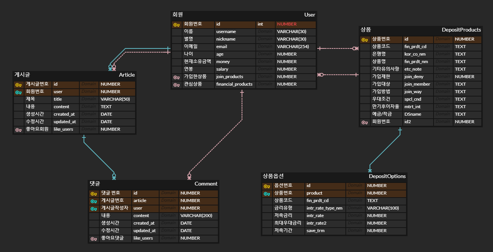

# 6️⃣ 금융 상품 추천 알고리즘에 대한 기술적 설명
- tensorflow(오픈 소스 딥러닝 프레임워크)의 model을 사용하여 딥러닝을 통해 사용자와 상품의 상관관계를 파악한다. 딥러닝을 기반으로 사용자가 가입한 상품을 확인하여 4개의 금융상품을 추천한다.

# 7️⃣ 서비스 대표 기능들에 대한 설명
* 검색한 지역의 은행 검색
    * '시/도'를 선택하면 그 지역에 해당하는 '시/군/구'를 선택할 수 있고 원하는 '은행'까지 선택한다. 선택한 지역에 있는 선택한 은행의 위치와 지점명을 출력해준다.
* AI를 통한 상품 추천
    * tensorflow의 model을 사용하여 사용자의 관심상품을 기반으로 비슷한 사용자가 가입한 금융상품 중 top-score를 가지는 상품 4개를 추천한다.

# 8️⃣ 주요 화면
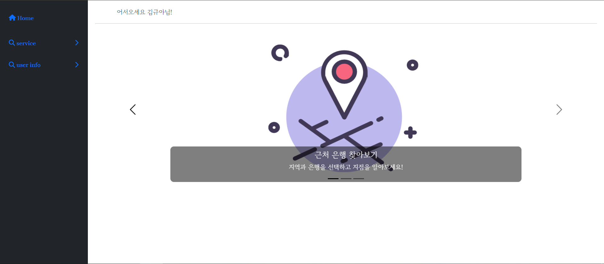
--
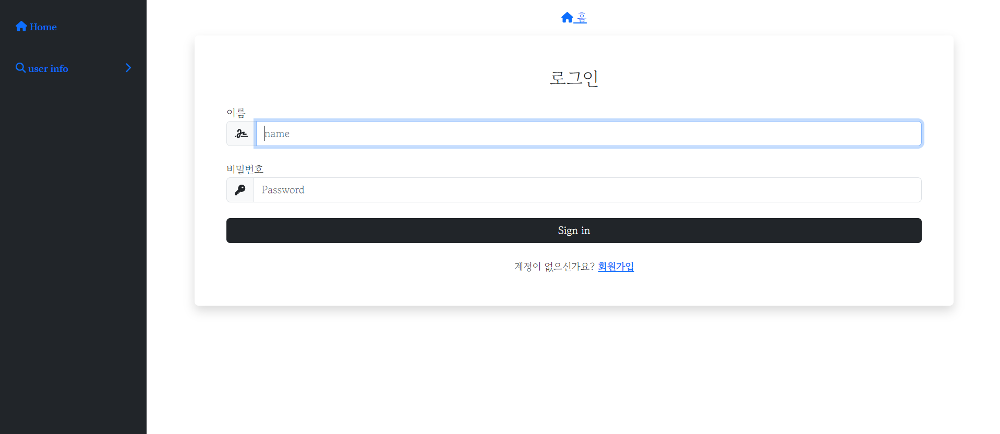
--
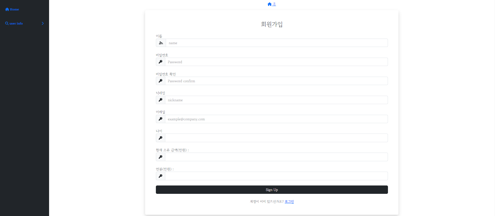
--
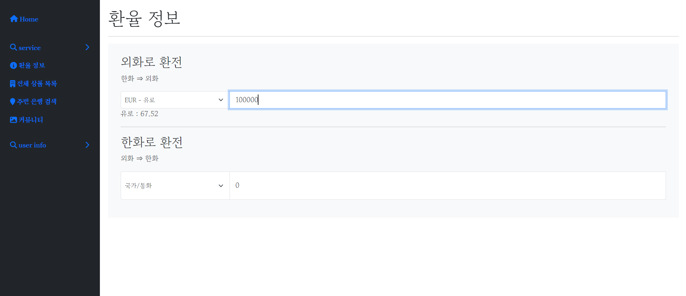
--
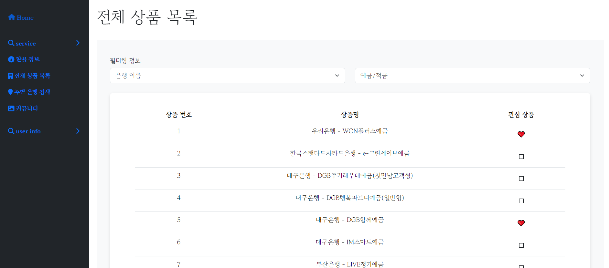
--
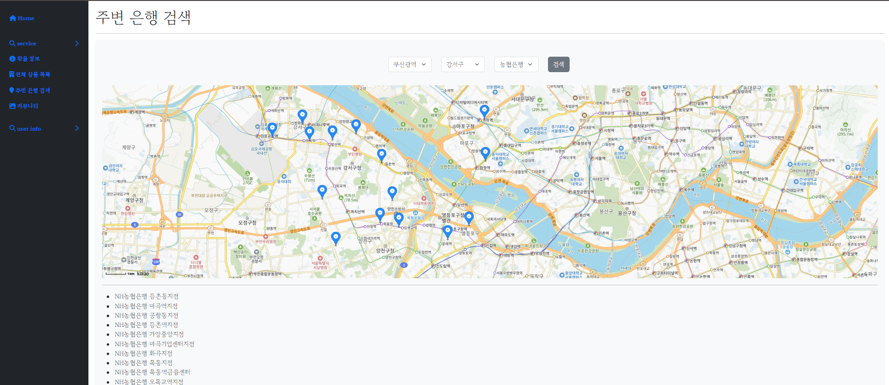
--
|상품 디테일 1|상품 디테일 2|
|:---:|:---:|
|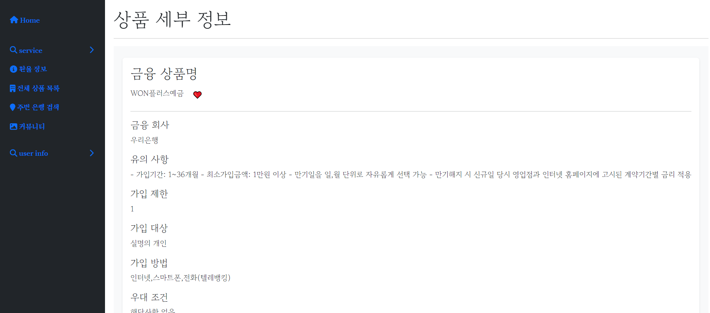|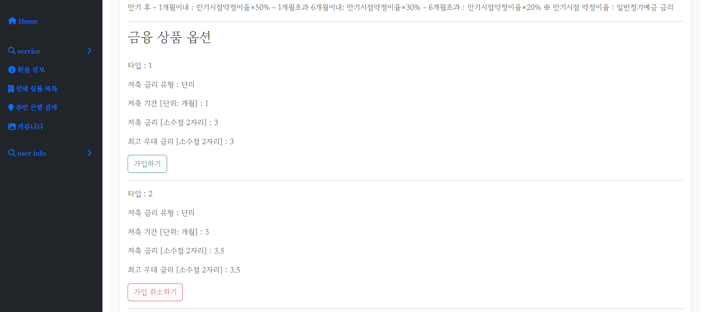|

--
|커뮤니티|게시글|
|:---:|:---:|
|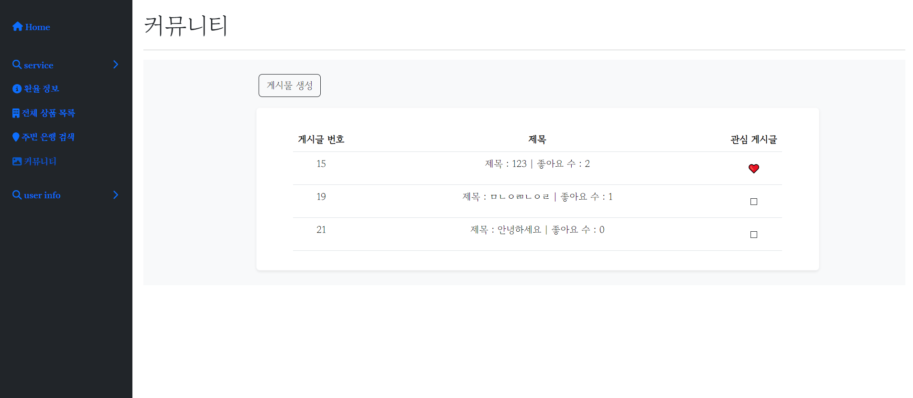 |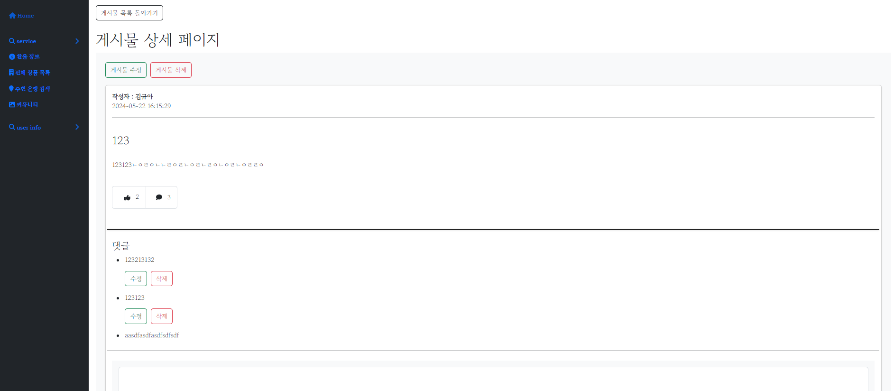|

--
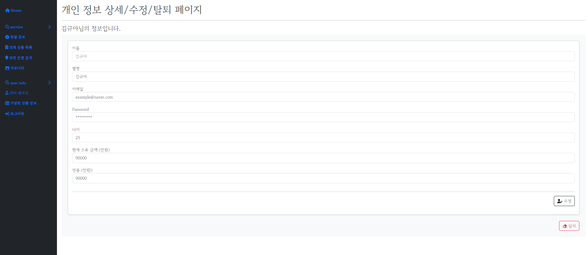
--
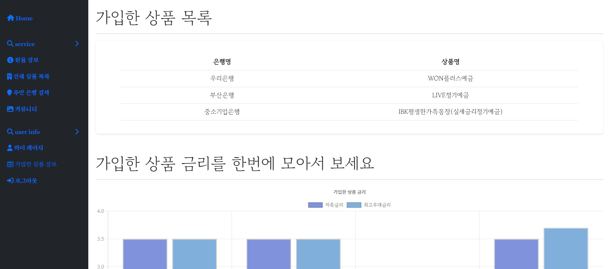
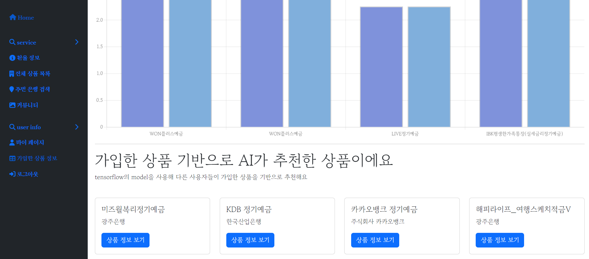