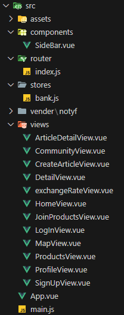
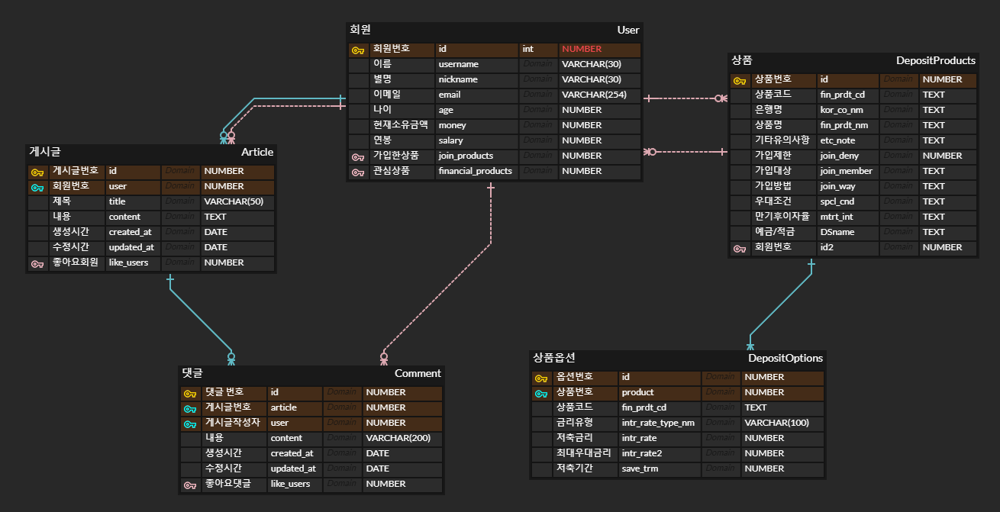

# 팀원 정보 및 업무 분담 내역
* 김태경
    * 팀장
    * main BACKEND
    * sub FRONTEND
    * 검토 & 수정 & 보완
* 김규아
    * 팀원
    * main BACKEND
    * main FRONTEND
    * API관련 업무

# 설계 내용(아키텍쳐 등) 및 실제 구현 정도
* 설계 내용
    1. 시스템 개요
        * 목표 : 기존 데이터를 기반으로 한 금융 상품 추천 서비스
    2. 구성 요소

        

        * ArticleDetailView : 게시물 상세 정보(수정 및 삭제, 댓글)
        * CommunityView : 커뮤니티 페이지
        * CreateArticleView : 게시물 생성 페이지
        * DetailView : 상품 상세 정보 페이지
        * exchangeRateView : 환율 계산기 페이지
        * HomeView : 메인 페이지
        * JoinProductsView : 가입한 상품 목록 및 비교 및 AI상품 추천
        * LoginView : 로그인 페이지
        * MapView : 특정 지역의 은행 찾는 페이지
        * ProductsView : 전체 상품 목록 및 상품 목록 filtering 페이지
        * ProfileView : 프로필 페이지(수정 및 탈퇴)
        * SignUpView : 회원 가입 페이지
    3. 기술 스택
        * python 3.9.x
        * Django 4.2.x
        * Node.js 20.x
        * Vue 3 & Pinia
* 실제 구현 정도
    * 구현된 기능
        * 회원가입, 회원탈퇴, 정보 수정
        * 게시물 생성, 수정, 삭제
        * 댓글 생성, 수정, 삭제
        * 환율 정보 조회
        * 금융 상품 목록 조회 및 상세 정보
        * 게시글 좋아요, 금융상품 관심 등록 서비스
        * 지역단위 주변 은행 검색
    * 테스트 및 검증
        * API를 활용하여 더미 데이터를 받아 원하는 정보만을 가공, 수집하여 테스트 하였다.
        * 테스트 결과 원하는 결과로 출력이 되었다.

# 데이터 베이스 모델링(ERD)

# 금융 상품 추천 알고리즘에 대한 기술적 설명
tensorflow(오픈 소스 딥러닝 프레임워크)의 model을 사용하여 딥러닝을 통해 사용자와 상품의 상관관계를 파악한다. 딥러닝을 기반으로 사용자가 가입한 상품을 확인하여 4개의 금융상품을 추천한다.

# 서비스 대표 기능들에 대한 설명
* 검색한 지역의 은행 검색
    * '시/도'를 선택하면 그 지역에 해당하는 '시/군/구'를 선택할 수 있고 원하는 '은행'까지 선택한다. 선택한 지역에 있는 선택한 은행의 위치와 지점명을 출력해준다.
* AI를 통한 상품 추천
    * tensorflow(오픈 소스 딥러닝 프레임워크)의 model을 사용하여 딥러닝을 통해 사용자와 상품의 상관관계를 파악한다. 딥러닝을 기반으로 사용자가 가입한 상품을 확인하여 4개의 금융상품을 추천한다.

# 기타(느낀점, 후기 등)
* 김태경 : 이번 프로젝트를 하면서 단순하게 한두페이지가 아닌 많은 페이지를 동시에 구성하면서 코드의 가독성과 수정 및 보완에 대한 생각이 많이 들었다. 그동안 배운 것을 집약적으로 사용해 볼 수 있었다. 또한 backend와 frontend에 모두 참여하면서 data flow를 코드를 짜 보면서 느낄 수 있었다. 처음으로 해보는 협업 프로젝트였는데 그만큼 많은 대화가 필요했다. 이 과정에서 정확하고 구체적으로 말하지 않아 협업하는 과정에서 내가 생각한 것과 조금 다르게 이해하여 생각한 방향이 엉키는 경우도 있었고, 이 부분을 다시 얘기해 봄으로써 좀더 명확한 방향성을 잡을 수 있어서 소통의 중요성을 배우게 되었다.
* 김규아 : 관통프로젝트라는 이름에 맞게, 한학기 동안 배운 내용 전부를 관통하는 프로젝트였다.
백엔드부터 프론트엔드까지 구현하며 가끔은 배웠던 내용에서 헤맸지만, 팀이기에 목표를 완수할 수 있었다.
아직 경험적으로 많이 부족하다는 것을 느꼈다. 또한 개발자로 한걸음 더 가까워진 것을 느꼈다.
